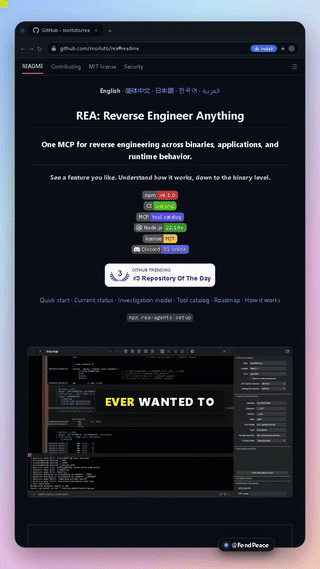
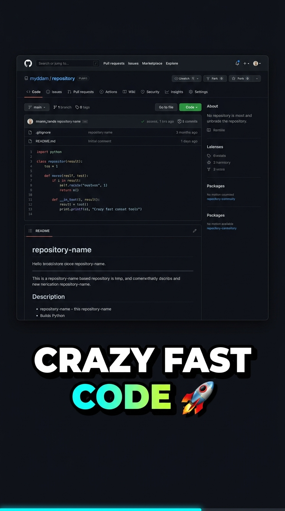
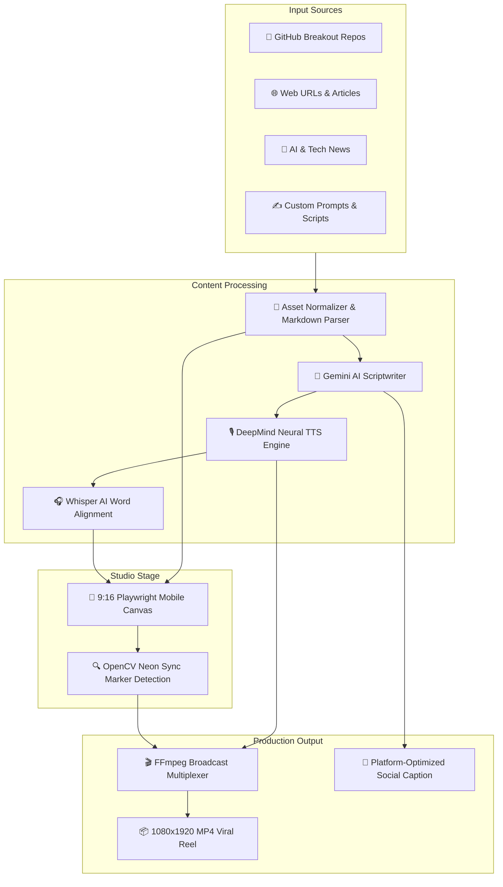

<div align="center">

# 🚀 WebVideoStudio
### *Autonomous Multi-Platform 9:16 Viral Reel Engine & Universal Web Video Suite*

[](https://github.com/jastfan/WebVideoStudio/stargazers)
[](https://fondpeace.com)
[](https://python.org)
[](https://fastapi.tiangolo.com)
[](https://playwright.dev)
[](https://github.com/openai/whisper)
[](LICENSE)

<br/>

<!-- Community & Social Badges -->
[](https://fondpeace.com)
[](https://www.youtube.com/channel/UCXUG7LfzEiIgv3Rvf5r01SQ)
[](https://www.instagram.com/fondpeacecrazy)
[](https://www.threads.net/@fondpeacecrazy)
[](https://www.facebook.com/profile.php?id=61595100991996&sk=reels_tab)
[](https://x.com/fondpeacecrazy)

<br/>

**Transform trending GitHub repositories, web articles, documentation, SaaS landing pages, and custom scripts into viral, broadcast-grade 9:16 short-form video reels in one click.**

<br/>


</div>

---

## 🎬 Live Generated Video Output

Experience the actual video output generated 100% autonomously by **WebVideoStudio** — featuring frame-accurate 0.00s audio-visual synchronization, Google DeepMind neural narration, dynamic scrolling, and CapCut bouncy karaoke subtitles:

<div align="center">
<table>
  <tr>
    <td align="center" width="50%">
      <b>⚡ Live 9:16 Autonomous Reel Output (Preview)</b><br/><br/>
      <br/><br/>
      <a href="assets/sample_reel.mp4"><b>▶️ Click here to watch / download the full 1080x1920 MP4 Video</b></a><br/>
      <i>(Clean 60fps audio-video lockstep, DeepMind voiceover & word-level karaoke sync)</i>
    </td>
    <td align="center" width="50%">
      <b>✨ CapCut Neon Marker & Kinetic Captions</b><br/><br/>
      <br/><br/>
      <a href="assets/cyan_reel.jpg"><b>🌌 View Electric Cyberpunk Reel Theme</b></a><br/>
      <i>(Highlighter pill tag on spoken words, 3D mind-blown emoji & audio waveform tracking)</i>
    </td>
  </tr>
</table>
</div>

---

## 🌐 FondPeace Community & Creator Ecosystem

**WebVideoStudio** is proudly developed under the **[FondPeace](https://fondpeace.com)** creative initiative — building autonomous AI pipelines and digital creator tools for modern developers and storytellers:

| Platform | Channel / URL | Purpose & Content |
| :--- | :--- | :--- |
| 🌐 **Official Website** | [fondpeace.com](https://fondpeace.com) | The primary digital hub for creative tools, AI breakthroughs, and creator products |
| 📺 **YouTube** | [FondPeace Official Channel](https://www.youtube.com/channel/UCXUG7LfzEiIgv3Rvf5r01SQ) | High-retention tech breakdowns, Shorts, and autonomous pipeline guides |
| 📸 **Instagram** | [@fondpeacecrazy](https://www.instagram.com/fondpeacecrazy) | Daily viral reels, creator drops, and developer showcases |
| 🧵 **Threads** | [@fondpeacecrazy](https://www.threads.net/@fondpeacecrazy) | Real-time discussions, open-source highlights & community updates |
| 👥 **Facebook** | [FondPeace Reels](https://www.facebook.com/profile.php?id=61595100991996&sk=reels_tab) | Short-form developer reels and trending software highlights |
| 🐦 **X (Twitter)** | [@fondpeacecrazy](https://x.com/fondpeacecrazy) | Breaking tech news, AI developments, and changelogs |
| 💻 **GitHub** | [jastfan / WebVideoStudio](https://github.com/jastfan/WebVideoStudio) | Open-source codebase, bug reports, and community contributions |

---

## 💡 What is WebVideoStudio?

**WebVideoStudio** is an all-in-one, autonomous video production suite designed for tech content creators, developer advocates, founders, and social media managers. 

It completely removes the tedious manual editing workflow — eliminating screen recording setups, manual voiceover recording, subtitle synchronization, cutaways, and video exporting. 

With **WebVideoStudio**, you provide an input (a GitHub repo, a web URL, an AI announcement, or a custom prompt), and the engine autonomously:
1. **Parses & Cleans** web content, markdown, images, badges, and documentation.
2. **Generates High-Retention Viral Scripts** utilizing Gemini AI hooked to modern social retention frameworks.
3. **Synthesizes Studio-Quality Narration** with Google DeepMind neural voices (*Puck, Fenrir, Zephyr, Kore, Charon*).
4. **Performs Word-Level Karaoke Subtitle Alignment** using OpenAI Whisper AI.
5. **Records a Pixel-Perfect 9:16 Mobile Canvas** inside an automated Playwright headless/headed browser stage.
6. **Eliminates Dead Frames & White Flashes** using computer-vision OpenCV neon-green frame sync for lockstep 0.00s audio-visual synchronization.
7. **Produces Broadcast-Ready 1080x1920 MP4 Reels** accompanied by ready-to-publish captions with emojis and 25+ viral hashtags.

---

## 🚀 Beyond GitHub: Universal Content Production Engine

While WebVideoStudio excels at transforming open-source GitHub repositories into viral videos, **it is engineered as a universal video engine for virtually ANY content**:

```
                               ┌────────────────────────────────────────┐
                               │       WebVideoStudio Input Modes       │
                               └──────────────────┬─────────────────────┘
                                                  │
         ┌──────────────────┬─────────────────────┼─────────────────────┬──────────────────┐
         │                  │                     │                     │                  │
         ▼                  ▼                     ▼                     ▼                  ▼
┌──────────────────┐┌──────────────────┐┌───────────────────┐┌──────────────────┐┌──────────────────┐
│ 🐙 GitHub Repos  ││  🌐 Web URLs &   ││  🤖 AI & Tech     ││ 🚀 Product Hunt  ││ ✍️ Custom Script │
│  Trending repos, ││   Blog Articles  ││   News Digests    ││   & SaaS Demos   ││  & Prompt-to-    │
│  READMEs, tags,  ││  Medium, Dev.to, ││ Research papers,  ││ Feature tours,   ││  Video storytelling│
│  releases & code ││ docs & portals   ││ HuggingFace drops ││ landing pages    ││ with sound fx   │
└──────────────────┘└──────────────────┘└───────────────────┘└──────────────────┘└──────────────────┘
```

1. **🐙 GitHub Breakouts & Repositories**: Real-time scraper pulls star counts, languages, and formatted documentation into a punchy showcase.
2. **🌐 Any Web Article or Documentation (URL-to-Video)**: Convert documentation portals, Medium posts, Substack newsletters, and tech blogs into dynamic scrolling video walkthroughs.
3. **🤖 AI & Tech News Highlights**: Summarize groundbreaking papers, HuggingFace releases, and tech breakthroughs in punchy 45-60 second reels.
4. **🚀 Product Launches & SaaS Demos**: Turn landing pages and Product Hunt launches into engaging product promo reels with animated subtitles and voiceover.
5. **✍️ Custom Script & Prompt Mode**: Paste your own custom script or topic prompt for complete creative freedom with automated kinetic captions and audio sync.
6. **📱 Multi-Platform Optimization**: Outputs 1080x1920 vertical video natively calibrated for **YouTube Shorts**, **Instagram Reels**, **TikTok**, **Threads**, **Facebook Reels**, and **X / Twitter**.

---

## 📱 Visual Reel Output & CapCut Caption Gallery

<div align="center">
<table>
  <tr>
    <td align="center" width="33%">
      <b>🎬 Viral 9:16 Mobile Reel</b><br/><br/>
      <br/>
      <i>Chunky 3D kinetic typography, active yellow bounce, fire emoji & bottom glowing progress bar.</i>
    </td>
    <td align="center" width="33%">
      <b>⚡ CapCut Neon Marker</b><br/><br/>
      <br/>
      <i>Highlighter pill tag on spoken words, 3D mind-blown emoji & audio waveform tracking.</i>
    </td>
    <td align="center" width="33%">
      <b>🌌 Electric Cyan Cyberpunk</b><br/><br/>
      <br/>
      <i>Cyan/Lime electric gradient, code block glow, and dynamic audio visualization.</i>
    </td>
  </tr>
</table>
</div>

---

## ✨ Key Features & Technical Innovation

* **🔥 Autonomous Breakout Discovery**: Real-time integration with `jastfan/github-trending` identifying breakout repositories with star velocity metrics.
* **🎙️ Google DeepMind Studio Neural TTS**: Expressive voices (**Puck**, **Fenrir**, **Zephyr**, **Kore**, **Charon**) with automatic multi-key quota failover pool.
* **🎯 Frame-Accurate Zero-Delay Sync Engine**: 
  - Injects a computer-vision neon-green sync trigger (`[0, 255, 0]`) into the stage.
  - OpenCV inspects video frames and precisely strips away `about:blank` and browser initialization dead time.
  - Audio narration and video scroll start at **exact 0.00s lockstep synchronization**.
* **💬 CapCut / Hormozi Kinetic Karaoke Subtitles**:
  - Word-level active word highlight with spring bounce animations.
  - Contextual 3D emojis (🔥, 🚀, ⚡, 🤯, 💡, 💻) dynamically triggered by spoken keywords.
  - Plain-text subtitle fallback during speech micro-pauses for clean presentation.
* **📜 Asset Normalization & Asset Guard**:
  - Converts relative GitHub markdown links into absolute raw GitHub CDN URLs (`raw.githubusercontent.com/.../HEAD/...`).
  - Supports `md_in_html` with centered badges, GitHub shields, SVG logos, and Discord buttons.
* **🖥️ Universal Cross-Device App**:
  - Fully responsive across **Desktop**, **Tablet**, and **Mobile** with PWA support.
  - Standalone frameless desktop app launcher (`FondPeaceStudio.bat` / `launch_app.py`) that operates without browser URL bars or window clutter.
* **📄 One-Click Viral Social Captions**: Automatically generates clean plain-text captions with emojis and 25+ viral developer hashtags ready to paste directly on Instagram, YouTube Shorts, Threads, and Facebook Reels.

---

## 🏗️ Architecture & Pipeline



---

## ⚡ Quickstart Guide

### 1. Prerequisites
Ensure you have **Python 3.10+** installed. (FFmpeg is automatically handled via `imageio-ffmpeg`).

### 2. Clone the Repository
```bash
git clone https://github.com/jastfan/WebVideoStudio.git
cd WebVideoStudio
```

### 3. Install Dependencies
```bash
pip install -r requirements.txt
playwright install chromium
```

---

## 💻 Running WebVideoStudio

### Option A: Standalone Frameless Desktop App (Recommended)
Launch the studio as an independent desktop application with zero browser address bars:

* **Windows**: Double-click `FondPeaceStudio.bat` or run:
```bash
python launch_app.py
```

### Option B: Local Web Studio Server
Run the FastAPI development server:
```bash
python server.py
```
Open **http://127.0.0.1:8000** in your browser or install it as a PWA on mobile.

### Option C: CLI Mode (Headless Batch Automation)
Render a viral reel directly from terminal:

```bash
# Render today's #1 trending GitHub repo
python build_gittrend_reel.py

# Render a specific custom GitHub repository
python -c "import asyncio; from build_gittrend_reel import build_instant_gittrend_reel; asyncio.run(build_instant_gittrend_reel(repo_target='facebook/react'))"
```

---

## ⚙️ Configuration & Environment Variables

Create a `.env` file in the project root:

```env
# Gemini API Keys (comma-separated for automatic quota pooling & failover)
GEMINI_API_KEYS=your_gemini_key_1,your_gemini_key_2,your_gemini_key_3

# Studio Narration Defaults
DEFAULT_DEEPMIND_VOICE=Puck
DEFAULT_SCROLL_SPEED_PPS=28.0
INITIAL_HOLD_SEC=1.8

# Social Branding
DEFAULT_BRAND_TEXT=@fondpeacecrazy
```

---

## 📂 Repository Directory Structure

```
WebVideoStudio/
├── assets/                  # High-resolution UI screenshots, reel demos & branding
│   ├── studio_ui.png        # Desktop studio interface preview (with loaded repos)
│   ├── reel_demo.gif        # Live animated reel preview
│   ├── sample_reel.mp4      # Broadcast 1080x1920 sample video
│   ├── reel_preview.jpg     # 9:16 mobile reel visual demo
│   ├── capcut_captions.jpg  # CapCut kinetic captions showcase
│   ├── cyan_reel.jpg        # Electric cyan cyberpunk style showcase
│   └── app_icon.png         # 512x512 app logo
├── static/                  # Web app front-end (HTML, CSS, JS, PWA assets)
│   ├── index.html           # Universal responsive studio layout
│   ├── style.css            # Dark glassmorphism & responsive breakpoints
│   ├── app.js               # Frontend interactive logic & real-time sync
│   ├── manifest.json        # PWA installation configuration
│   └── sw.js                # Service worker for offline resiliency
├── build_gittrend_reel.py   # Master 9:16 video generation engine & sync pipeline
├── server.py                # FastAPI backend server & async render task manager
├── launch_app.py            # Native frameless desktop app launcher
├── FondPeaceStudio.bat      # 1-click double-click desktop launcher
├── asset_normalizer.py      # GitHub README image & markdown-in-html normalizer
├── script_generator.py      # High-retention AI script & clean caption generator
├── tts_engine.py            # Studio voice synthesis with multi-key failover
├── trending_fetcher.py      # Breakout repository discovery & scraping
├── config.py                # Global parameters, voices, and speed limits
└── requirements.txt         # Project dependencies
```

---

## 🤝 Contributing

Contributions, feature suggestions, and pull requests are warmly welcomed!
1. Fork the Project (`https://github.com/jastfan/WebVideoStudio`)
2. Create your Feature Branch (`git checkout -b feature/AmazingFeature`)
3. Commit your Changes (`git commit -m 'Add some AmazingFeature'`)
4. Push to the Branch (`git push origin feature/AmazingFeature`)
5. Open a Pull Request

---

## 📄 License

Distributed under the **MIT License**. See `LICENSE` for more information.

<div align="center">
<sub>Engineered with precision for viral open-source and developer storytelling. Built with ❤️ by <a href="https://github.com/jastfan">jastfan</a> & <a href="https://fondpeace.com">FondPeace</a>.</sub>
</div>
