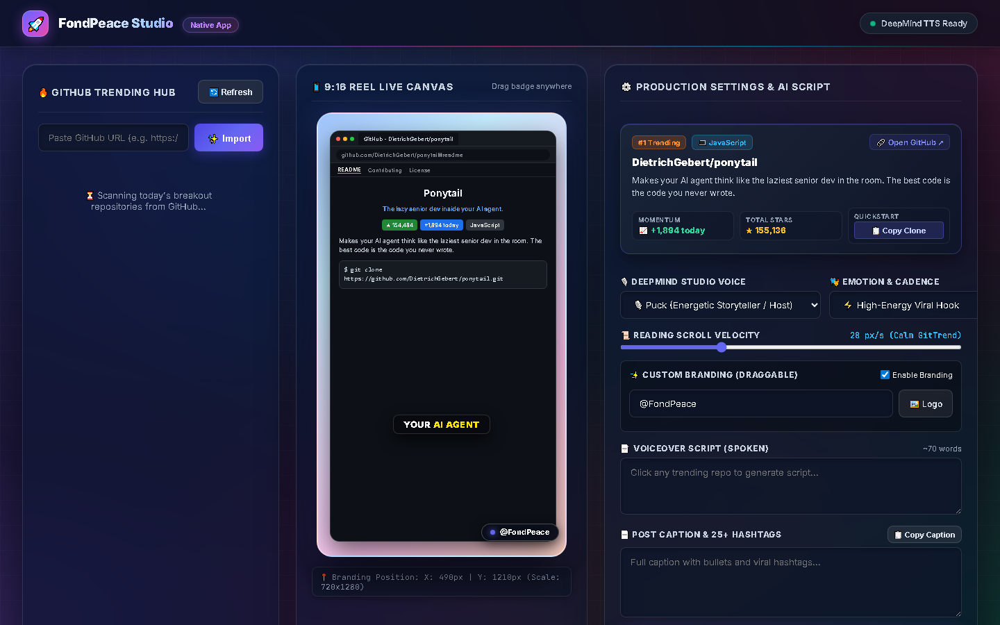
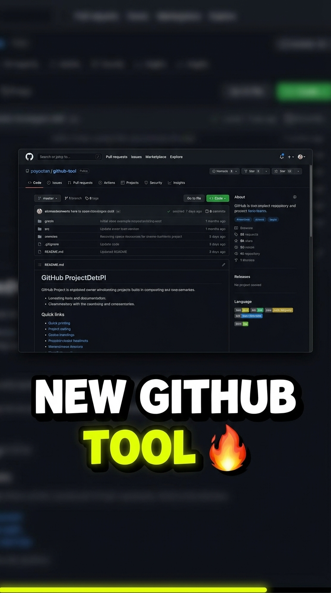
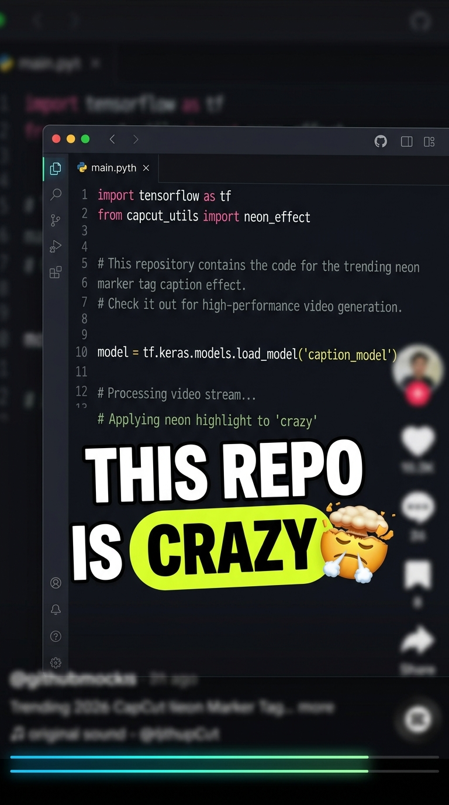
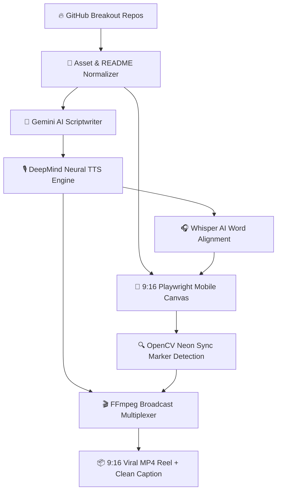

<div align="center">

# 🚀 WebVideoStudio
### *Autonomous Viral GitTrend Reel Engine & Creative Production Suite*

[](https://github.com/jastfan/WebVideoStudio/stargazers)
[](https://python.org)
[](https://fastapi.tiangolo.com)
[](https://playwright.dev)
[](https://github.com/openai/whisper)
[](LICENSE)

<br/>

**Transform trending open-source GitHub repositories into viral, studio-grade 9:16 short-form reels for Instagram, TikTok, YouTube Shorts, and Threads in one click.**

<br/>



</div>

---

## 💡 What is WebVideoStudio?

**WebVideoStudio** is a zero-manual-editing, autonomous video generation platform designed for tech creators, developer advocates, and open-source communities.

It monitors trending breakout GitHub repositories daily, parses documentation and visual assets, synthesizes high-energy neural narration using **Google DeepMind Studio Voices**, performs word-level karaoke subtitle alignment with **OpenAI Whisper AI**, records the repository stage inside a 9:16 mobile canvas using **Playwright**, and produces broadcast-standard **1080x1920 MP4 reels** with zero white frames, frame-accurate synchronization, and ready-to-post social captions.

---

## 📱 Visual Reel Output & CapCut Captions

<div align="center">
<table>
  <tr>
    <td align="center" width="50%">
      <b>🎬 Viral 9:16 Mobile Reel Output</b><br/><br/>
      <br/>
      <i>Chunky 3D kinetic typography, active yellow bounce, fire emoji & bottom glowing progress bar.</i>
    </td>
    <td align="center" width="50%">
      <b>⚡ CapCut Neon Marker Preset</b><br/><br/>
      <br/>
      <i>Highlighter pill tag on spoken words, 3D mind-blown emoji & audio waveform tracking.</i>
    </td>
  </tr>
</table>
</div>

---

## ✨ Key Features & Capabilities

* **🔥 Automated Trend Discovery**: Real-time scanning of today's breakout repositories from `jastfan/github-trending` with daily star gain metrics and language pills.
* **🎙️ Google DeepMind Studio TTS**: High-cadence studio voices (**Puck**, **Fenrir**, **Zephyr**, **Kore**, **Charon**) with automatic multi-key quota failover.
* **🎯 Frame-Accurate Zero-Delay Sync Engine**: Precision calibration with OpenCV neon-green trigger marker (`[0, 255, 0]`) eliminates leading dead/white frames (`about:blank`), ensuring audio and video start at exact **0.00s lockstep**.
* **💬 CapCut / Hormozi Kinetic Karaoke Subtitles**: Word-level active highlighting with `hl-yellow`, spring bounce animations, matching 3D emojis (🔥, 🚀, ⚡, 🤯), and clean plain-text fallback during speech micro-pauses.
* **📜 Asset Normalization & Asset Guard**: Automatic conversion of relative markdown image links to raw GitHub CDN URLs (`raw.githubusercontent.com/.../HEAD/...`), with `md_in_html` support for centered banners, shields.io badges, and Discord buttons.
* **🖥️ Universal Cross-Device App**: Responsive across **Desktop**, **Tablet**, and **Mobile** with PWA support and a dedicated frameless desktop app launcher (`FondPeaceStudio.bat` / `launch_app.py`) that runs without browser address bars or URL tabs.
* **📄 Platform-Ready Social Captions**: Automatically generates clean plain-text captions with emojis and 25+ viral developer hashtags ready to paste directly on Instagram, YouTube Shorts, Threads, and Facebook Reels.

---

## 🏗️ Architecture & Processing Pipeline



---

## ⚡ Quickstart Guide

### 1. Prerequisites
Ensure you have **Python 3.10+** and **FFmpeg** installed (FFmpeg is automatically handled via `imageio-ffmpeg`).

### 2. Clone the Repository
```bash
git clone https://github.com/jastfan/WebVideoStudio.git
cd WebVideoStudio
```

### 3. Install Dependencies
```bash
pip install -r requirements.txt
playwright install chromium
```

---

## 💻 Running WebVideoStudio

### Option A: Standalone Native Desktop App (Recommended)
Launch the frameless desktop app with zero address bar and native OS windowing:

* **Windows**: Double-click `FondPeaceStudio.bat` or run:
```bash
python launch_app.py
```

### Option B: Local Web Studio Server
Run the FastAPI development server:
```bash
python server.py
```
Open **http://127.0.0.1:8000** in your browser.

### Option C: CLI Mode (Headless Batch Automation)
Render a viral reel for today's #1 breakout repository directly from terminal:
```bash
# Render today's #1 trending repo
python build_gittrend_reel.py

# Render a specific custom GitHub repository
python -c "import asyncio; from build_gittrend_reel import build_instant_gittrend_reel; asyncio.run(build_instant_gittrend_reel(repo_target='facebook/react'))"
```

---

## ⚙️ Configuration & Environment Variables

Create a `.env` file in the project root:

```env
# Gemini API Keys (comma-separated for automatic quota pooling & failover)
GEMINI_API_KEYS=your_gemini_key_1,your_gemini_key_2,your_gemini_key_3

# Studio Narration Defaults
DEFAULT_DEEPMIND_VOICE=Puck
DEFAULT_SCROLL_SPEED_PPS=28.0
INITIAL_HOLD_SEC=1.8

# Branding
DEFAULT_BRAND_TEXT=@FondPeace
```

---

## 📂 Repository Directory Structure

```
WebVideoStudio/
├── assets/                  # High-resolution README screenshots, reel demos & icons
│   ├── studio_ui.png        # Desktop studio interface preview
│   ├── reel_preview.jpg     # 9:16 mobile reel visual demo
│   ├── capcut_captions.jpg  # CapCut kinetic captions showcase
│   └── app_icon.png         # 512x512 app logo
├── static/                  # Web app front-end (HTML, CSS, JS, PWA assets)
│   ├── index.html           # Universal responsive studio layout
│   ├── style.css            # Dark glassmorphism & responsive breakpoints
│   ├── app.js               # Frontend interactive logic & real-time sync
│   ├── manifest.json        # PWA installation configuration
│   └── sw.js                # Service worker for offline resiliency
├── build_gittrend_reel.py   # Master 9:16 video generation engine & sync pipeline
├── server.py                # FastAPI backend server & async render task manager
├── launch_app.py            # Native frameless desktop app launcher
├── FondPeaceStudio.bat      # 1-click double-click desktop launcher
├── asset_normalizer.py      # GitHub README image & markdown-in-html normalizer
├── script_generator.py      # High-retention AI script & clean caption generator
├── tts_engine.py            # Studio voice synthesis with multi-key failover
├── trending_fetcher.py      # Breakout repository discovery & scraping
├── config.py                # Global parameters, voices, and speed limits
└── requirements.txt         # Project dependencies
```

---

## 🤝 Contributing

Contributions, feature suggestions, and pull requests are warmly welcomed!
1. Fork the Project (`https://github.com/jastfan/WebVideoStudio`)
2. Create your Feature Branch (`git checkout -b feature/AmazingFeature`)
3. Commit your Changes (`git commit -m 'Add some AmazingFeature'`)
4. Push to the Branch (`git push origin feature/AmazingFeature`)
5. Open a Pull Request

---

## 📄 License

Distributed under the **MIT License**. See `LICENSE` for more information.

<div align="center">
<sub>Engineered with precision for viral open-source storytelling.</sub>
</div>
